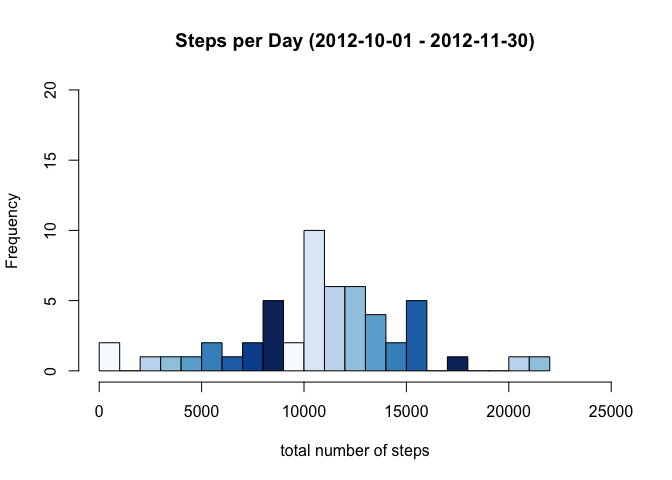
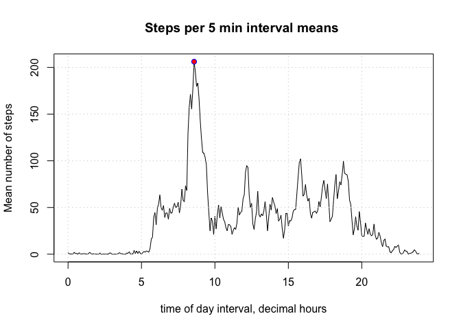
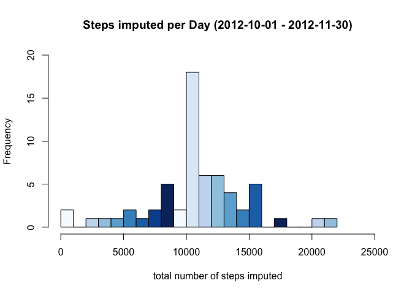
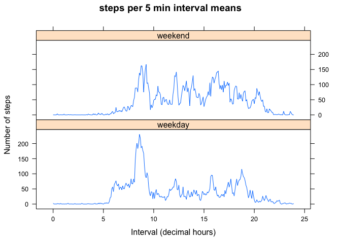

# Reproducible Research: Peer Assessment 1
gsgxnet  


## Introduction

We are evaluating a sample of 61 days of a persons activity data collected by a personal tracking device in 5 minute intervals.   

## Preparing the environment

to load and process the data we need to prepare our environment with the 
needed libraries and setup some variables and functions.  

### Load libraries

```r
library(data.table)  # keep all datasets in an optimal structure 
library(xtable)  # visualize tables
library(lattice)  # plot panels
```
### Get data 

```r
unzip("activity.zip", setTimes = TRUE)
```

## Loading and preprocessing the data

### load data into a data.table


```r
activity <- fread("activity.csv", header = TRUE)
```
The variables included in this dataset are:

* **steps**: Number of steps taking in a 5-minute interval (missing
    values are coded as `NA`)

* **date**: The date on which the measurement was taken in YYYY-MM-DD
    format

* **interval**: Identifier for the 5-minute interval in which
    measurement was taken  
    
### a tiny subset of the data as a preview

```r
xt <- xtable(activity[date=="2012-10-04" & interval >= 1100 & interval <= 1200,])
print(xt, type="HTML")
```

<!-- html table generated in R 3.2.3 by xtable 1.8-0 package -->
<!-- Wed Jan  6 00:16:24 2016 -->
<table border=1>
<tr> <th>  </th> <th> steps </th> <th> date </th> <th> interval </th>  </tr>
  <tr> <td align="right"> 1 </td> <td align="right">   0 </td> <td> 2012-10-04 </td> <td align="right"> 1100 </td> </tr>
  <tr> <td align="right"> 2 </td> <td align="right">   0 </td> <td> 2012-10-04 </td> <td align="right"> 1105 </td> </tr>
  <tr> <td align="right"> 3 </td> <td align="right">   0 </td> <td> 2012-10-04 </td> <td align="right"> 1110 </td> </tr>
  <tr> <td align="right"> 4 </td> <td align="right">   0 </td> <td> 2012-10-04 </td> <td align="right"> 1115 </td> </tr>
  <tr> <td align="right"> 5 </td> <td align="right">   0 </td> <td> 2012-10-04 </td> <td align="right"> 1120 </td> </tr>
  <tr> <td align="right"> 6 </td> <td align="right"> 180 </td> <td> 2012-10-04 </td> <td align="right"> 1125 </td> </tr>
  <tr> <td align="right"> 7 </td> <td align="right">  21 </td> <td> 2012-10-04 </td> <td align="right"> 1130 </td> </tr>
  <tr> <td align="right"> 8 </td> <td align="right">   0 </td> <td> 2012-10-04 </td> <td align="right"> 1135 </td> </tr>
  <tr> <td align="right"> 9 </td> <td align="right">   0 </td> <td> 2012-10-04 </td> <td align="right"> 1140 </td> </tr>
  <tr> <td align="right"> 10 </td> <td align="right">   0 </td> <td> 2012-10-04 </td> <td align="right"> 1145 </td> </tr>
  <tr> <td align="right"> 11 </td> <td align="right">   0 </td> <td> 2012-10-04 </td> <td align="right"> 1150 </td> </tr>
  <tr> <td align="right"> 12 </td> <td align="right">   0 </td> <td> 2012-10-04 </td> <td align="right"> 1155 </td> </tr>
  <tr> <td align="right"> 13 </td> <td align="right"> 160 </td> <td> 2012-10-04 </td> <td align="right"> 1200 </td> </tr>
   </table>
The "interval" is a label for the 5-minute interval, not a (date)time-object.
The interval can be directly used as an x-axis value for plotting, but will not result in equidistant intervals in the plot. For the interval plots within this document a decimal hour+minute interval is calculated and used for the x-axis. The code for the standard plots is given as well but commented out. See comments.

## What is mean total number of steps taken per day?

### process raw to analysis data

```r
activitybyday <- activity[, .(stepsday=sum(steps)), by=date] # 
```
### histogram of the steps per day 

```r
hist(activitybyday[, stepsday], breaks=25, xlim=c(0,25000), ylim=c(0,20), col=blues9, main = paste0("Steps per Day (", activitybyday[1,date], " - ", activitybyday[.N,date],")"), xlab = "total number of steps")
```

 

### mean and median 


```r
stepsdaymean <- mean(activitybyday[, stepsday], na.rm = TRUE)
stepsdaymedian <- median(activitybyday[, stepsday], na.rm = TRUE)
```
The mean activity per day reported by the activitytracker is 10766.2 steps.  Their median is 10765. 


## What is the average daily activity pattern?

### process raw to analysis data

```r
# convert interval to 1) a real time object and 2) to decimal hours
activity[, intervalTime := as.ITime(formatC(interval, width = 4, flag = "0"), format = "%H%M")]
activity[, intervalTimeDec := as.numeric(substr(formatC(interval, width = 4, flag = "0"),1,2)) + as.numeric(substr(formatC(interval, width = 4, flag = "0"),3,4))/60]
activitybyinterval <- activity[, .(stepsintvmean=mean(steps,na.rm = TRUE)), by=interval]
activitybyintervalTime <- activity[, .(stepsintvmean=mean(steps,na.rm = TRUE)), by=intervalTime]
activitybyintervalTimeDec <- activity[, .(stepsintvmean=mean(steps,na.rm = TRUE)), by=intervalTimeDec]
stepsintvmax <- max(activitybyinterval[, stepsintvmean], na.rm = TRUE)
stepsintvmaxintv <- activitybyinterval[which.max(stepsintvmean), ]
stepsintvmaxintvTimeDec <- activitybyintervalTimeDec[which.max(stepsintvmean), ]
```
The interval of the day with the maximum mean number of steps is 835. For that timeslot the mean over all days is 206.1698113 steps.

### timeline of daily activity

```r
# code for a plot very similar to the sample given in the instructions
# omitted, as it will have not even spaced x axis intervals although
# the data consists of even spaced time interval measurements
#plot(activitybyinterval,type="l", main = "steps per 5 min interval means ", xlab = "time of day interval", ylab = "mean number of steps" )
#grid()
#points(stepsintvmaxintv$interval, stepsintvmaxintv$stepsintvmean, col="blue", pch=21, bg = "red")
plot(activitybyintervalTimeDec,type="l", main = "Steps per 5 min interval means ", xaxs = "r", xlab = "time of day interval, decimal hours", ylab = "Mean number of steps" )
points(stepsintvmaxintvTimeDec$interval, stepsintvmaxintvTimeDec$stepsintvmean, col="blue", pch=21, bg = "red")
grid()
```

 


## Imputing missing values

### process raw to analysis data

There are missing values (NAs) in the original datasets. The presence of missing days may introduce bias into some calculations or summaries of the data. We can improve on that possible bias by replacing a missing value in an day-interval by the mean value of that interval calculated over all other days fow which a value exists. A new dataset for analysis and the days mean and median are calculated.  


```r
activityimputed <- activity # create a copy of the dataset
# calculated a new column in the dataset 
# containig either the mean of steps for that interval over all days if the number of steps is NA 
# or a copy of the value of the number of steps in that interval
activityimputed <- activityimputed[, `:=`(stepsimputed = ifelse( is.na(steps), mean(steps,na.rm = TRUE), steps)), by=interval]
activityimputedbyday <- activityimputed[, .(stepsimputedday=sum(stepsimputed)), by=date]
stepsimputeddaymean <- mean(activityimputedbyday[, stepsimputedday])
stepsimputeddaymedian <- median(activityimputedbyday[, stepsimputedday])
```
The mean activity per day reported by the activitytracker corrected for missing values is 10766.2 steps.  Their median is 10766.2. Compared to the mean of steps without correction there is no difference. Comparing medians, the median after imputing is 1.2 steps higher than the median calculated without correction. This kind of NA replacement has no impact on the calculated mean activity per day and an non significant impact on the median.  

### histogram of the steps imputed per day 

```r
hist(activityimputedbyday[, stepsimputedday], breaks=25, xlim=c(0,25000), ylim=c(0,20), col=blues9, main = paste0("Steps imputed per Day (", activityimputedbyday[1,date], " - ", activityimputedbyday[.N,date],")"), xlab = "total number of steps imputed")
```

 

The histogram for the imputed steps values shows a different distribution of total number of steps than the histogram for the raw total number containing NAs. The Frequency for the 10000 to 11000 range is now 18 instead of 10. This could be caused by imputing whole days of NAs with means of the other days intervals. 

## Are there differences in activity patterns between weekdays and weekends?

### process raw to analysis data


```r
activityimputedWd <- activityimputed # create a copy of the working dataset
# create new columns in the dataset for
# 1 abbreviated day of week
# 2 marking every row as either weekday or weekend 
# this implementation here works only for english and german locales
# a more general implementation should use 
# strftime(as.Date(date), format = "%u")
activityimputedWd[, `:=`(wkday = weekdays(as.Date(date), abbreviate = TRUE), wkdayend = as.factor(ifelse(weekdays(as.Date(date), abbreviate = TRUE) %in% c("Sat","Sun", "Sa", "So"),"weekend","weekday")))]
# calculate the interval means for weekdays and weekends
activityimputedbyinterval <- activityimputedWd[, .(stepsimputedintvmean=mean(stepsimputed)), by=.(interval,wkdayend)]
activityimputedbyintervalTimeDec <- activityimputedWd[, .(stepsimputedintvmean=mean(stepsimputed)), by=.(intervalTimeDec,wkdayend)]
```

### activity pattern plot for weekdays and weekends


```r
library(lattice)
# this code would produce a plot very similar to the instructions,
# but again with uneven x-axis intervals, s.a..
#xyplot(activityimputedbyinterval$stepsimputedintvmean ~ activityimputedbyinterval$interval | activityimputedbyinterval$wkdayend, layout = c(1, 2), xlab = "Interval", ylab = "Number of steps", type="l")
# an implementation using decimal hours which has even spaced x-axis intervals
# equivalent to the dataset
xyplot(activityimputedbyintervalTimeDec$stepsimputedintvmean ~ activityimputedbyintervalTimeDec$intervalTimeDec | activityimputedbyintervalTimeDec$wkdayend, layout = c(1, 2),  main = "steps per 5 min interval means", xlab = "Interval (decimal hours)", ylab = "Number of steps", type="l")
```

 

### Summary

The patterns for weekends and weekdays look quite different. Further evaluation might reveal a statistical model to discern for a new days activity dataset whether it is data of a working day or not.
